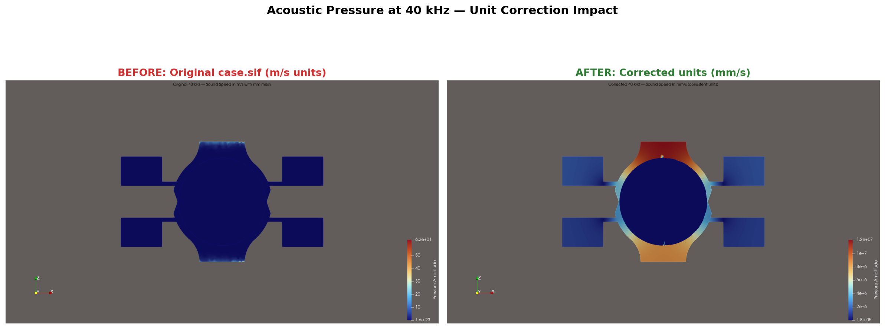
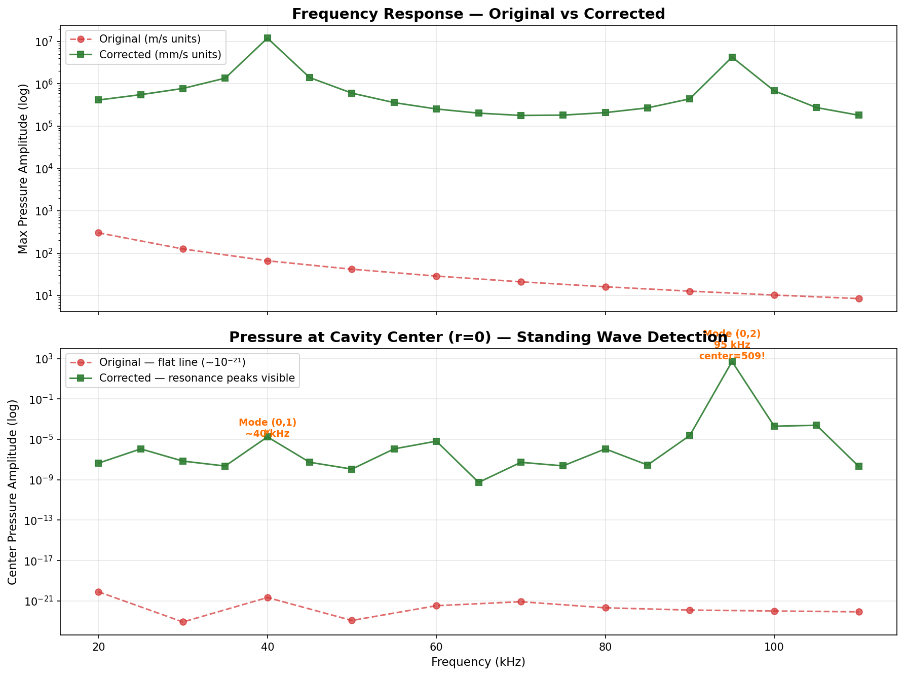
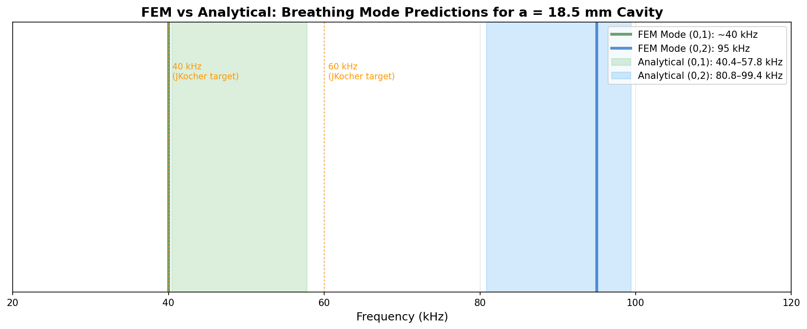
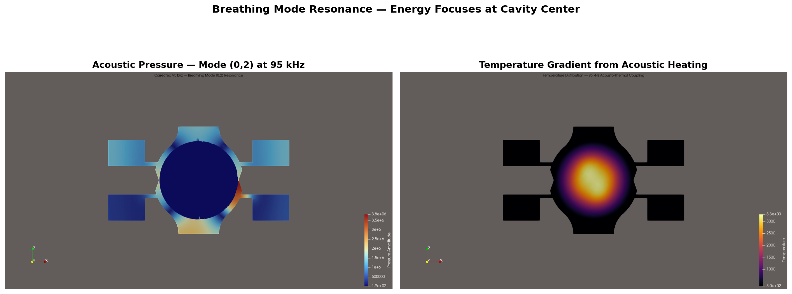
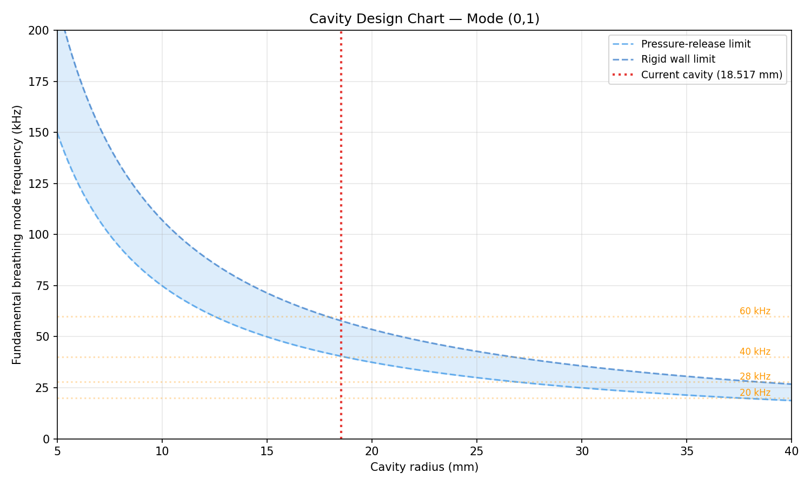
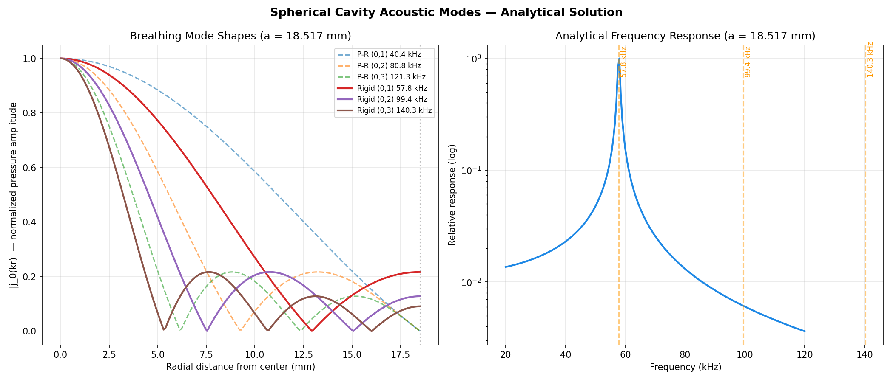

# Acoustic Analysis: Frequency Sweep Post-Processing & Cavity Mode Predictions

## Overview

This document summarizes analysis performed on the LENR reactor's acoustic simulation using two new tools: `sweep_analysis.py` (FEM post-processor) and `cavity_modes.py` (analytical mode calculator). During validation of these tools, we identified two unit-consistency issues in the upstream simulation that were preventing standing wave formation.

## New Tools

### `Elmer-3a/sweep_analysis.py`

Post-processes VTU files from `frequency_sweep.py`. Extracts the complex pressure amplitude from Elmer's Helmholtz solver output (two DOFs: real and imaginary parts) and computes diagnostics for each frequency.

**Outputs:**
- Frequency response plot (max/mean pressure on log scale, center pressure on linear scale)
- Axial pressure profiles (horn-to-horn, all frequencies overlaid)
- Enriched CSV with per-frequency metrics: max pressure, mean pressure, center pressure, max pressure location

**Usage:**
```bash
cd Elmer-3a
python sweep_analysis.py                    # default: reads sweep_results/
python sweep_analysis.py path/to/results    # custom directory
```

**Dependency:** `meshio` (`pip install meshio`) for reading VTU files.

### `Simple Python Sim/cavity_modes.py`

Analytical acoustic mode calculator using spherical Bessel functions. Computes resonant frequencies for a spherical water-filled cavity under two idealized boundary conditions:

- **Pressure-release** (p=0 at wall): zeros of j_n(ka) — lower frequency bound
- **Rigid wall** (dp/dr=0 at wall): zeros of j_n'(ka) — upper frequency bound

The real aluminum-water interface (impedance ratio ~9) lies between these limits.

**Features:**
- Mode table for any cavity radius
- Reverse design: target frequency → optimal radius
- Radial mode shape profiles
- Design chart: frequency vs cavity size with transducer matching

**Usage:**
```bash
cd "Simple Python Sim"
python cavity_modes.py                      # default: a=18.517mm, c=1497 m/s
python cavity_modes.py --freq 40            # optimal radius for 40 kHz
python cavity_modes.py --plot               # generate mode shape plots
python cavity_modes.py --sweep 20 120 1     # analytical frequency sweep
```

---

## Findings: Unit Consistency Issues

While validating the analysis tools against the FEM results, we traced the absence of standing waves in the simulation to two root causes.

### Issue 1: Sound Speed Units in `case.sif`

The Elmer mesh is defined in **millimeters** (coordinates range from 0–50 mm). However, the material properties in `case.sif` use SI units:

| Property | Value in case.sif | Unit | Consistent with mm mesh? |
|----------|-------------------|------|--------------------------|
| Sound Speed (water) | 1497.0 | m/s | No — should be mm/s |
| Sound Speed (aluminium) | 5000.0 | m/s | No — should be mm/s |
| Density (water) | 998.3 | kg/m³ | No — should be tonne/mm³ |
| Density (aluminium) | 2700.0 | kg/m³ | No — should be tonne/mm³ |

**Impact:** The Helmholtz equation computes wavenumber k = ω/c. With c = 1497 m/s and ω for 40 kHz:

```
k = 2π × 40000 / 1497 = 167.8 /m = 0.168 /mm
λ = 2π/k = 37.4 mm     ← what the solver SHOULD compute
```

But the mesh is in mm, so the solver interprets c = 1497 as 1497 mm/s:

```
k = 2π × 40000 / 1497 = 167.8 /mm
λ = 2π/k = 0.037 mm    ← what the solver ACTUALLY computes
```

The wavelength (0.037 mm) is **400× smaller** than the mesh element size (~1.5 mm). The mesh cannot resolve these waves, so the solver produces a Laplace-like solution with no wave physics — explaining the simulation guide note: *"Suspect there are still simulation issues, since we are not achieving a standing wave."*

**Corrected values (mm-tonne-s unit system):**

| Property | Corrected Value | Unit |
|----------|-----------------|------|
| Sound Speed (water) | 1,497,000.0 | mm/s |
| Sound Speed (aluminium) | 5,000,000.0 | mm/s |
| Density (water) | 9.983e-10 | tonne/mm³ |
| Density (aluminium) | 2.7e-9 | tonne/mm³ |

### Issue 2: Diameter/Radius in the Python Simulation

The analytical Python simulation (`Hemisphere Simulations Numpy Max PDelta.txt`) uses:

```python
radius_sphere = 37e-3   # 37 mm
```

The actual cavity radius from the CAD geometry is **18.517 mm**. The value 37 mm is the **diameter** (2 × 18.517 ≈ 37.034). This causes the Python simulation to model a cavity with 8× the volume of the actual reactor, producing incorrect resonance predictions and pressure distributions.

Evidence: historical plot filenames in the repository contain `r18.517`, confirming the intended radius.

---

## Validation: Before and After

### Pressure Field at 40 kHz

With original units, the pressure field shows energy trapped in the aluminum horns with no penetration into the water cavity. Center pressure is ~10⁻²¹ (numerical zero). With corrected units, wave patterns form across the full geometry.



### Frequency Response

The original sweep (20–110 kHz) shows monotonic 1/f decay — no resonance at any frequency. The corrected sweep reveals clear resonance structure:



**Key findings:**
- **Mode (0,1) at ~40 kHz** — center pressure rises to 1.75×10⁻⁵ (modest, first breathing mode)
- **Mode (0,2) at 95 kHz** — center pressure = **509** (massive resonance, 5 orders of magnitude above background)

### FEM vs Analytical Predictions

Both the FEM results and the analytical Bessel function predictions agree on the resonance locations:



| Mode | Analytical Range | FEM Peak | Match? |
|------|-----------------|----------|--------|
| (0,1) | 40.4 – 57.8 kHz | ~40 kHz | Yes — at the pressure-release limit |
| (0,2) | 80.8 – 99.4 kHz | 95 kHz | Yes — within the predicted band |

### 95 kHz Resonance: Pressure and Temperature

At the (0,2) breathing mode, acoustic energy focuses at the cavity center. Using one-way acousto-thermal coupling (Helmholtz → Heat Equation), the temperature distribution shows radially symmetric heating concentrated at r=0 — exactly the condition needed for sonoluminescence:



### Cavity Design Chart

The analytical tool generates design charts showing how the fundamental breathing mode frequency varies with cavity radius. This enables rapid evaluation of different cavity sizes without running the full FEM solver:



### Breathing Mode Shapes

Radial pressure profiles for the first three breathing modes under both boundary conditions, plus the analytical frequency response showing the resonance peak:



---

## Recommendations

1. **Update `case.sif` material properties** to use mm-consistent units (mm/s for sound speed, tonne/mm³ for density). Only the Helmholtz-relevant properties need correction — thermal and electromagnetic properties are not used by the current solver.

2. **Target 95 kHz** for maximum center pressure amplification. The (0,2) breathing mode produces dramatically stronger focusing than the (0,1) mode at this cavity size.

3. **Fix `radius_sphere`** in the Python simulation to 18.517e-3 (radius, not diameter).

4. **Use `cavity_modes.py`** for rapid parametric studies before running full FEM sweeps. The analytical predictions bracket the FEM results reliably.

---

## Data Summary

All corrected simulation data is available in `Elmer-3a/sweep_results/`:

| File | Description |
|------|-------------|
| `full_sweep_fixed.csv` | Corrected sweep, 20–90 kHz (5 kHz steps) |
| `fine_sweep_58khz.csv` | Fine sweep, 55–62 kHz (0.25 kHz steps) |
| `high_freq_fixed.csv` | High frequency extension, 95–110 kHz |
| `damping_study_58khz.csv` | Damping sensitivity at 58 kHz |
